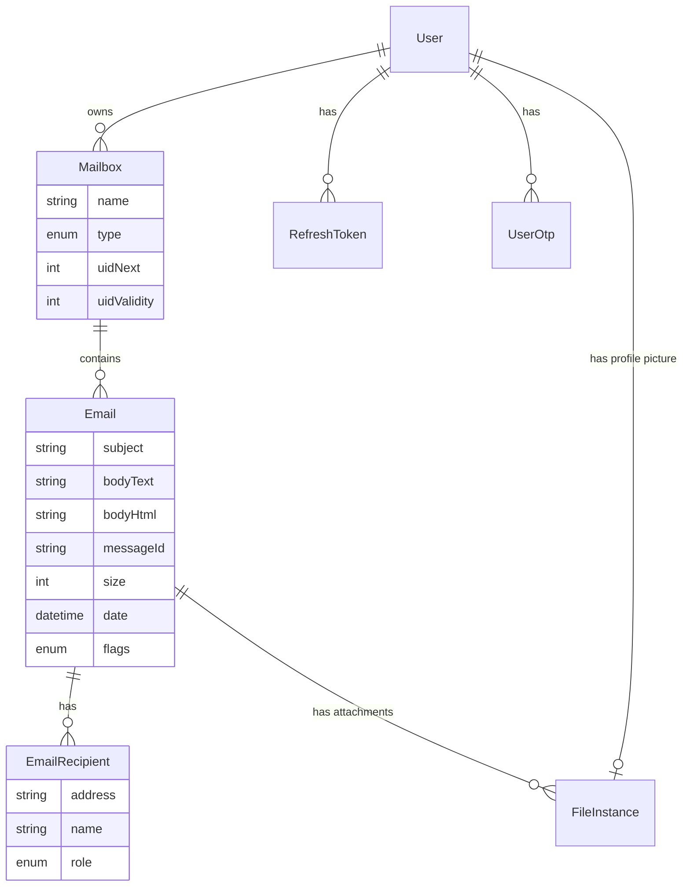

# Local Mail Stack

📧 **Local Mail Server for Development & Testing**

## One-liner

A fully local email system that supports sending, receiving, storing, and reading emails using real SMTP and IMAP protocols — built for developers to test email flows without external services.

## 🎯 Problem This Solves

Developers usually rely on:

- **Gmail**
- **Third-party tools**

This project:

- Runs 100% locally
- Uses real protocols
- **Gives full control + visibility** over internal mail flow
- **Perfect for testing transactional emails**

## 🧱 Core Stack

| Layer             | Tech          |
| :---------------- | :------------ |
| **SMTP Server**   | `smtp-server` |
| **Email Sending** | `nodemailer`  |
| **Email Parsing** | `mailparser`  |
| **IMAP Server**   | `ImapFlow`    |
| **Backend API**   | NestJS        |
| **Storage**       | PostgreSQL    |
| **Deployment**    | Docker        |

## 🧩 High-Level Architecture

```text
┌────────────┐
│ App / API  │
└─────┬──────┘
      │ SMTP
      ▼
┌──────────────┐
│ SMTP Server  │
└─────┬────────┘
      │ raw email
      ▼
┌──────────────┐
│ Mail Parser  │
└─────┬────────┘
      │ parsed email
      ▼
┌──────────────┐
│  Database    │
└─────┬────────┘
      │ IMAP
      ▼
┌──────────────┐
│ IMAP Server  │
└─────┬────────┘
      │
      ▼
┌──────────────┐
│ Email Client │
└──────────────┘
```

## 📊 Database Schema



## 🔁 Email Flow

1. **Sending Email**
   - App uses `Nodemailer`
   - Connects to `localhost:2525`
   - Sends email via SMTP
2. **Receiving Email**
   - `smtp-server` receives raw email
   - Passes stream to `mailparser`
   - Extracts: `From` / `To`, `Subject`, `Text` / `HTML`, `Attachments`
3. **Storage**
   - Emails stored in DB
   - Attachments saved to filesystem
   - Mailboxes: `INBOX`, `Sent`, `Drafts`
4. **Reading Email**
   - IMAP server exposes mailboxes
   - Email clients connect via IMAP
   - Read, search, mark read/unread

## ✨ Core Features

### SMTP

- Accept incoming emails
- Support multiple recipients
- Handle attachments
- Optional SMTP AUTH

### IMAP

- `INBOX` support
- Fetch emails
- Flags
- Pagination

### Backend

- Email persistence
- Mailbox management
- Email persistence
- Mailbox management
- User accounts ([View Auth Flow](./docs/auth-flow.md))

## 🚀 Advanced Features

- STARTTLS
- SMTP AUTH
- Multiple users & mailboxes
- IMAP IDLE
- **Real-time Event Triggers**
- Search
- Export `.eml`

## 🔒 Security Scope

This project is local-only by design:

- No public email sending
- No DKIM / SPF / DMARC
- No spam filtering
- No open relay

## 🏷️ Resume-Ready Description

> Built a local email server supporting SMTP and IMAP protocols using Node.js. Implemented email parsing, storage, and mailbox access using `Nodemailer`, `smtp-server`, `mailparser`, and `ImapFlow`. Designed for local development and testing of transactional email workflows.

---

### ✅ Final Check

- `nodemailer` → client
- `smtp-server` → receive emails
- `mailparser` → parse raw emails
- `ImapFlow` → read emails via IMAP

_This is a real mail system, not a mock._
