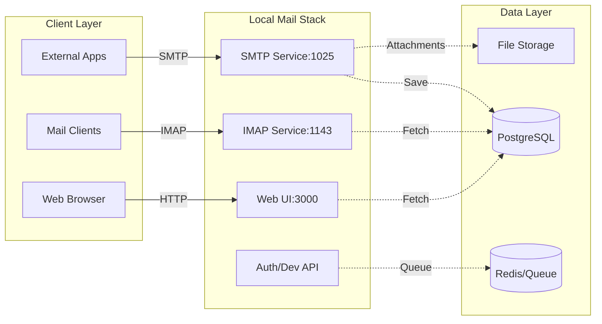

# Local Mail Stack

📧 **Self-hosted Local Email Environment (SMTP + IMAP) for Development & Testing**

## Overview

**Local Mail Stack** is a professional-grade email ecosystem that allows developers to test email flows locally using real SMTP and IMAP protocols. It includes a custom protocol implementation and a premium Web UI to monitor and manage local mailboxes.

## 🏗️ System Architecture



---

## 📚 Flow Documentation

For a deep dive into how specific modules operate, refer to our technical flow guides:

| Flow Guide                                       | Description                                                           |
| :----------------------------------------------- | :-------------------------------------------------------------------- |
| [🔐 **Authentication Flow**](docs/auth-flow.md)  | Details registration, internal verification emails, and OTP logic.    |
| [📧 **Mail Processing Flow**](docs/mail-flow.md) | Explains SMTP ingestion, dual-delivery logic, and storage mechanisms. |

---

## 🧱 Technical Stack

- **Backend**: NestJS
- **Database**: PostgreSQL (Prisma ORM)
- **Caching & Queues**: Redis & BullMQ
- **Protocols**:
  - **SMTP**: `smtp-server` (Port 1025)
  - **IMAP**: Custom TCP handler (Port 1143)
- **Web UI**: Handlebars + Vanilla CSS

---

## 🚀 Local Setup Guide

### 📋 Prerequisites

Ensure you have the following installed:

- [Node.js](https://nodejs.org/) (v20+)
- [pnpm](https://pnpm.io/)
- [Docker & Docker Compose](https://www.docker.com/)
- [Make](https://www.gnu.org/software/make/)

### 1. Environment Configuration

```bash
cp .env.example .env
```

### 2. Hybrid Development (Recommended)

```bash
# Start DB & Redis, install deps, run migrations, and start app
make local
```

### 3. Full Docker Environment

```bash
# Build and start all services in development mode
make dev-up
```

---

## 🛠 Makefile Reference

| Command       | Description                              |
| :------------ | :--------------------------------------- |
| `make local`  | **Recommended**: Start deps + local app. |
| `make dev-up` | Start full stack in Docker (Dev mode).   |
| `make build`  | Build the production Docker image.       |
| `make start`  | Start the production stack (Detached).   |

---

## 🔌 Port Mappings

| Service        | Host Port | Description              |
| :------------- | :-------- | :----------------------- |
| **Web UI**     | `3000`    | Mini Gmail Interface     |
| **SMTP**       | `1025`    | Inbound Mail Port        |
| **IMAP**       | `1143`    | Mail Client Sync Port    |
| **PostgreSQL** | `5433`    | Database access          |
| **pgAdmin**    | `8123`    | DB Web Management (Prod) |
