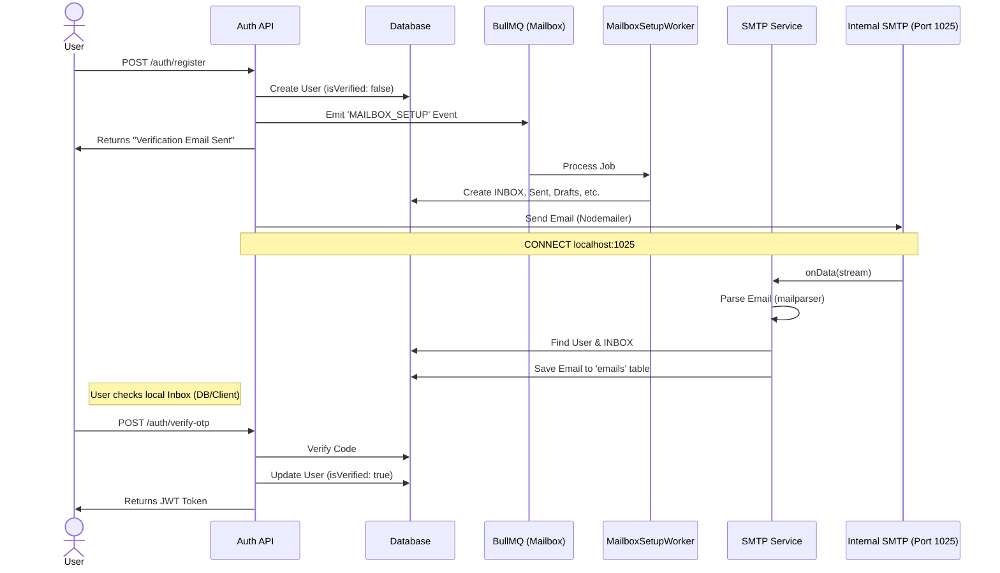

# Authentication Flow

This document outlines the authentication process in the Local Mail Stack, specifically focusing on the Registration and Email Verification flow which utilizes the internal SMTP server.

## 🔄 Registration & Verification Flow

The system uses a seamless, event-driven architecture to handle user registration, mailbox setup, and email delivery entirely within the local environment.

## 🛠️ Components Involved

### 1. Registration Service (`AuthRegisterService`)

- Creates the user record.
- Emits the `MAILBOX_SETUP` event to the `mailbox` queue.
- Generates a 6-digit OTP.
- Uses `AuthMailService` to trigger the email sending.

### 2. Mailbox Setup (`MailboxSetupWorker`)

- Listens to the `mailbox` queue.
- Automatically creates standard folders (`INBOX`, `Sent`, `Drafts`, `Trash`, `Spam`) for the new user.
- Ensures `uidValidity` is set correctly for future IMAP sync.

### 3. Internal SMTP (`SmtpService`)

- Listens on port `1025`.
- Intercepts the verification email sent by `Nodemailer`.
- Parses the email content headers and body.
- Saves the email directly to the recipient's `INBOX` in Postgres.

### 4. OTP Verification (`AuthOtpService`)

- Validates the code provided by the user against the database.
- Marks the user as `isVerified: true`.
- Issues a JWT token for session management.
