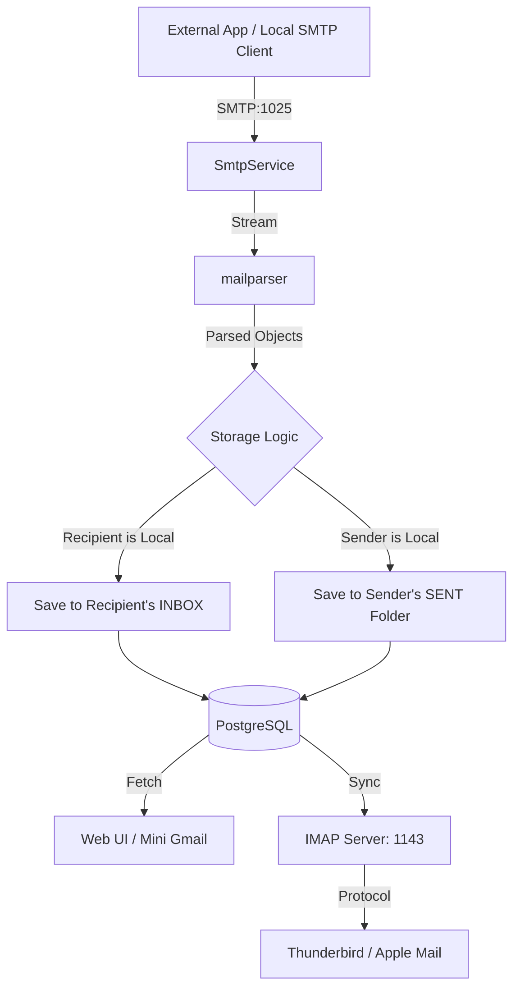

# Mail Processing Flow

This document details how the Local Mail Stack handles the lifecycle of an email, from ingestion via SMTP to storage and eventual consumption through the Web UI or IMAP clients.

## 🔄 End-to-End Email Lifecycle

The system acts as a real-time mail bridge, parsing raw TCP streams and transforming them into structured relational data.

## 🛠️ Step-by-Step Breakdown

### 1. Ingestion (`SmtpService`)

- **Transport**: Listens on TCP port `1025`.
- **Parsing**: Uses `mailparser` to handle `multipart/mixed`, `multipart/alternative`, and raw attachments.
- **Address Normalization**: Extracting normalized email addresses from headers like `From`, `To`, `Cc`, and `Bcc`.

### 2. Dual-Delivery Storage Logic

When an email is processed, the system performs two check-saves:

- **Inbox Delivery**: For every recipient found in the `To`, `Cc`, and `Bcc` headers that matches a local user email, a record is created in their `INBOX`.
- **Sent Archiving**: If the `From` address matches a local user, a record is also created in their `Sent` folder. This ensures that internally sent emails are correctly tracked for the sender.

### 3. Attachment Handling

- Attachments are extracted from the raw stream.
- The `FileService` stores them in the designated uploads directory.
- The database creates `Attachment` records linked to the specific `Email` entity.

### 4. Consumption Layers

#### Web Interface (`WebService`)

- Retrieves emails from the database.
- Implements a **Virtual "Sent" Folder**: Instead of relying solely on fixed folder IDs, it queries emails where the user is marked with `RecipientRole.FROM`, ensuring consistent visibility of sent communications.
- Provides server-side search across body text and headers.

#### IMAP Server (`ImapService`)

- Implements the IMAP protocol at the TCP level.
- Maps directory commands (`LIST`, `SELECT`) to database mailbox types.
- Translates RFC commands into Prisma queries to fetch message ranges and update flags (e.g., `\\Seen`).
